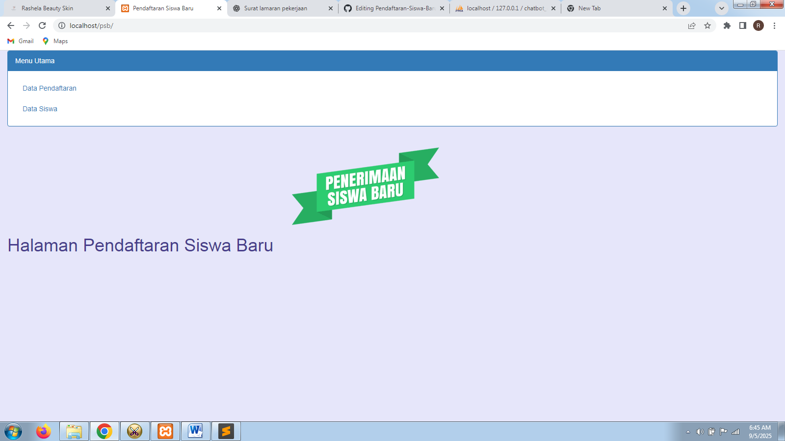

📄 README – PSB (Pendaftaran Siswa Baru)

📌 Student Admission Management System (PSB)

A web-based application to manage new student admissions. This system is designed for **admin use only** (backend).

---

🚀 Features

🛠️ Backend (Admin)

* Dashboard overview
* Manage Registrations (Add, Edit, Delete)
* Manage Student Data (Add, Edit, Delete)

---

🛠️ Tech Stack

* **Programming Language**: PHP, HTML, CSS
* **Framework/Library**: Native PHP + Bootstrap
* **Database**: MySQL
* **Tools**: XAMPP (Apache, PHP, MySQL), phpMyAdmin, Sublime Text

---

📂 Project Structure

```plaintext
/psb
 ┣ 📂 css           # css
 ┣ 📂 js            # js
 ┣ 📜 index.php     
 ┣ 📜 delete.php
 ┣ 📜 edit.php
 ┣ 📜 home.php
 ┣ 📜 incl.php
 ┣ 📜 koneksi.php
 ┣ 📜 pendaftaran.php
 ┣ 📜 siswa.php
 ┣ 📜 psb-screenshoot.png
 ┣ 📜 wallpaper.png
 ┣ 📜 README.md
 ┗ 📜 psb.sql  # SQL file to import database
```

---

⚙️ Installation & Usage

1. Clone the repository

   ```bash
   git clone https://github.com/rahma309/PSB-.git
   ```
2. Move project to XAMPP `htdocs` folder

   ```
   C:\xampp\htdocs\psb
   ```
3. Import database

   * Open phpMyAdmin → Create new DB `psb`
   * Import `psb.sql`
4. Run project

   * Start Apache & MySQL in XAMPP
   * Open browser → [http://localhost/psb](http://localhost/psb)
5. Default login (Admin)

   * Username: `admin`
   * Password: `admin`

---

📸 Screenshots



---

📈 Future Improvements

* Add user login for parents/students
* Generate admission reports (PDF/Excel)
* Email notification for successful registration

---

💻 Author

**Rahma Eka Putri**

* 📧 Email: [rahmaputri552@gmail.com](mailto:rahmaputri552@gmail.com)
* 🌐 GitHub: [github.com/rahmaputri309](https://github.com/rahma309)

